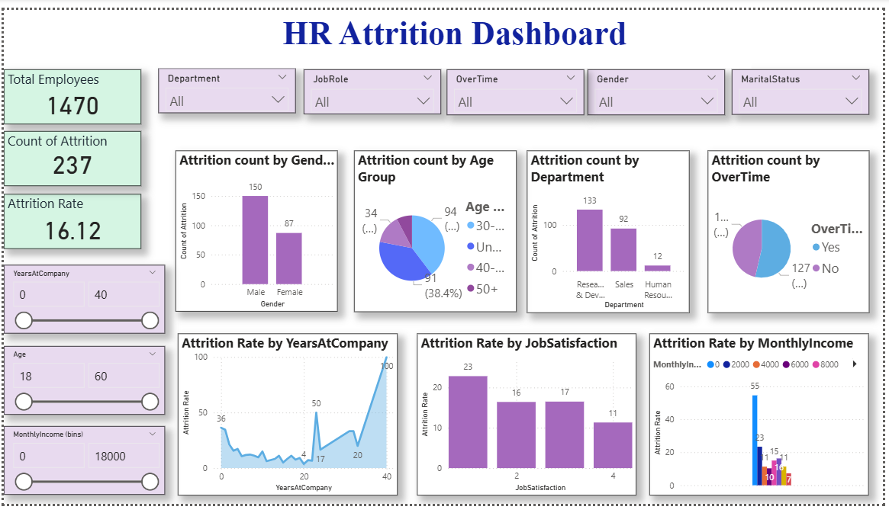

---

## 🖼️ Dashboard Preview

### **Page 1 – HR Overview**

### **Page 2 – Compensation & Growth Analysis**

### **Page 3 – Summary Dashboard**

---

## 🛠️ Tools Used

- **Power BI Desktop**  
- Data modelling  
- DAX measures  
- Interactive visuals and slicers  

---

## 📊 Key Insights

- Total employees and attrition rate are displayed at a glance  
- Attrition varies significantly with factors like salary hike, job role, monthly income, and promotions  
- Clear patterns help HR identify potential risk areas  

---

## 📥 How to Use

1. Download the `.pbix` file from this repository  
2. Open in **Power BI Desktop**  
3. Use slicers to explore insights across department, job role, and gender  

---

## 📄 PDF Version

A PDF export of the dashboard is available here:  
`pdf/HR_Attrition_Report.pdf`

---

## ✨ Author

Created by *Priyankapiaa* as part of a data analytics learning journey.

